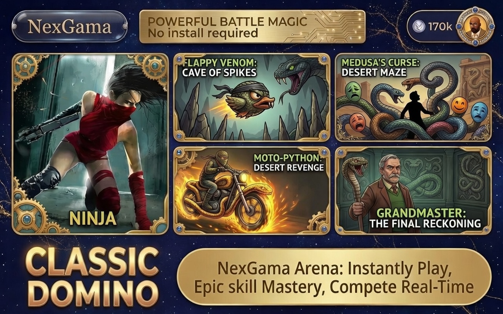

<meta name="title" content="NexGama - Premium All-in-One Gaming Portal">
<meta name="description" content="High-performance Android gaming shell with AdMob/Unity Ads obfuscation and integrated AdBlocker.">
<meta property="og:image" content="https://raw.githubusercontent.com/am-abdulmueed/nexgama/main/1.png">
<meta property="twitter:card" content="summary_large_image">

# NexGama - Premium All-in-One Gaming Portal

NexGama is a high-performance Android gaming application designed to be a one-stop destination for thousands of premium HTML5 games. Built with a focus on **security**, **user experience**, and **monetization optimization**, NexGama offers a seamless gaming experience while maximizing publisher revenue.

---
 

---

## 🚀 Key Features

### 1. Massive Game Library
* **Thousands of Games:** Access to a vast collection across multiple categories: Bubble Shooter, Mahjong, Puzzle, Card Games, Shooting, and more.
* **Instant Play:** No additional downloads required; games load instantly within the app.
* **Dynamic Updates:** catalog can be updated remotely via encrypted configuration files.

### 2. Advanced Security & Obfuscation
* **Data Encryption:** Game data and `game.json` are encrypted using XOR-based streams.
* **Ad ID Protection:** AdMob and Mediation IDs are obfuscated using **Base64 + XOR** to prevent revenue hijacking.
* **ProGuard/R8 Integration:** Optimized code shrinking for minimum APK size and maximum security.

### 3. Optimized Ad Monetization (eCPM Booster)
* **Advanced Mediation:** Integrated with **AdMob Mediation** and **Unity Ads** for high fill rates.
* **Diverse Ad Formats:** Strategic placement of App Open, Banners, Interstitials, Native Video, and Rewarded Ads.
* **Mediation Waterfall:** Pre-configured layers to capture the best bid for every impression.

### 4. Integrated Smart AdBlocker
* **Cleaner Experience:** Built-in ad blocker using top-tier filters (StevenBlack, AdGuardSDNS).
* **Improved Performance:** Faster game loading times and lower data consumption by blocking external trackers.

### 5. Premium UI/UX
* **Modern Design:** Built with **Jetpack Compose** for a smooth and responsive interface.
* **Dark Mode Support:** Sleek aesthetics for a premium feel.

---

## 💎 USP (Unique Selling Proposition)

**"The Most Secure & Profitable Gaming Aggregator Shell"**

Unlike standard gaming apps, NexGama's **Hardened Shell Technology** protects your livelihood by preventing cloning and ensuring your ads stay yours.

---

## 💰 Revenue Generation Potential

| Ad Type | Engagement Rate | Estimated eCPM | Revenue Impact |
| --- | --- | --- | --- |
| **Rewarded Video** | High | $7.00 - $15.00 | **Primary Driver** |
| **Interstitial** | Moderate | $2.50 - $5.00 | Consistent Income |
| **Native Video** | High | $1.50 - $3.00 | Non-intrusive |
| **App Open** | 100% | $1.00 - $2.00 | Passive Income |

---

## 🛠 Technical Stack
* **Language:** Kotlin
* **UI Framework:** Jetpack Compose
* **Build System:** Gradle (Kotlin DSL)
* **Ads:** Google AdMob + Unity Ads Mediation
* **Architecture:** MVVM (Model-View-ViewModel)
